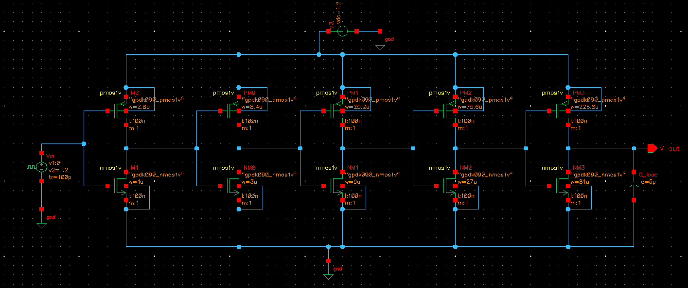
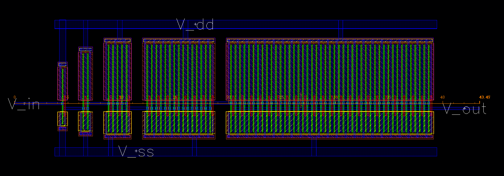
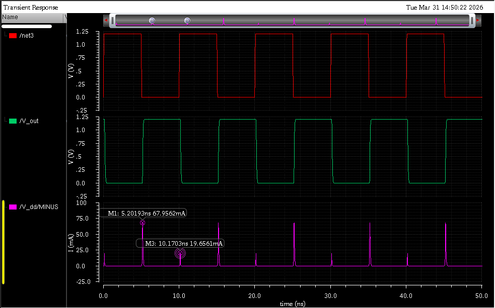

# Layout-Aware Low-Power CMOS Pixel Driver (90 nm)

## 📌 Overview
This project presents the full-custom design and layout-aware analysis of a 5-stage tapered CMOS pixel driver implemented in 90 nm CMOS (gpdk090) for display driver applications.

## 🎯 Objective
To design a high-speed, low-power buffer capable of driving a 5 pF capacitive load while analyzing the impact of layout parasitics across PVT variations.

## 🛠 Tools Used
- Cadence Virtuoso
- Spectre Simulator
- Assura (DRC/LVS)
- gpdk090 Technology

## ⚙️ Design Details
- 5-stage tapered inverter chain (f = 3)
- Wp/Wn = 2.8
- Supply Voltage: 1.2 V
- Load Capacitance: 5 pF

## 📊 Key Results
| Parameter | Value |
|----------|------|
| Pre-layout Delay | 162.8 ps |
| Post-layout Delay | 180.2 ps |
| Parasitic Delay Penalty | 10.7% |
| Max Variation (FF Corner) | 11.9% |
| Power | ~1 mW |
| PDP | 180.3 fJ |

## 🔬 Key Insight
Post-layout delay penalty is **corner-dependent**, with the FF corner showing the highest degradation. This highlights the importance of layout-aware PVT validation in high-speed buffer design.

## 🧩 Design Flow
Schematic → Layout → DRC → LVS → PEX → Post-layout Simulation → PVT Analysis

## 🖼️ Results

### Schematic

### Layout

### Waveform

## 🚀 Future Scope
- Skew-optimized tapering
- Multi-Vth optimization
- Scaling for high-resolution displays

## 📄 Research Work
Submitted to IEEE VDAT 2026
